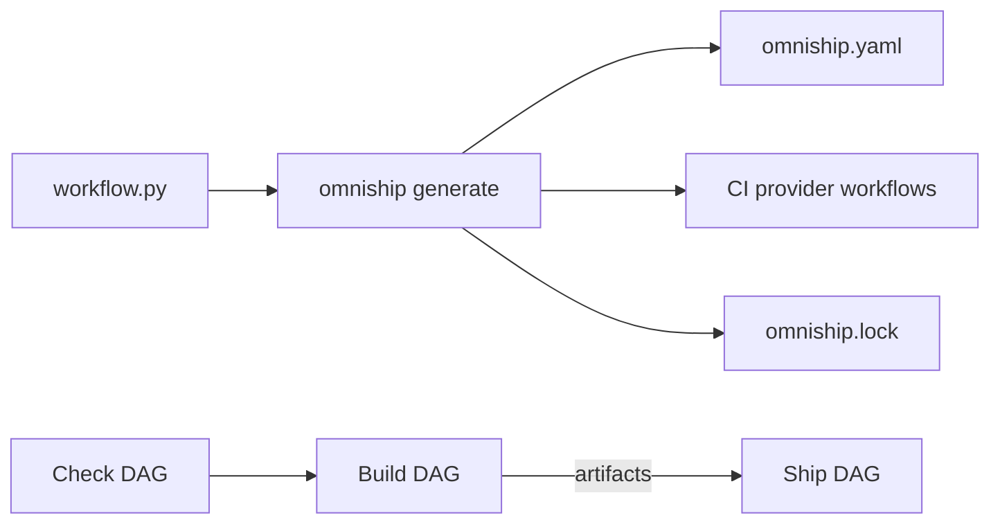

# OmniShip

OmniShip is a portable software delivery pipeline that defines how software is
checked, built, and shipped, then executes or compiles that pipeline for CI
providers.

You describe the delivery process in `workflow.py` using typed blocks,
imperative Python tasks, or a recipe. OmniShip validates the three stage DAGs
and generates a provider-neutral execution plan. Provider plugins can also
compile that plan into native CI files. The bundled GitHub plugin generates
separate Check, Build, and Ship workflows for GitHub Actions.

Current package version: `0.1.0`. OmniShip is pre-1.0 and its public API may
still change.

## Contents

- [Install from source](#install-from-source)
- [Quick start](#quick-start)
- [The pipeline model](#the-pipeline-model)
- [Writing tasks](#writing-tasks)
- [Artifacts](#artifacts)
- [GitHub Actions](#github-actions)
- [Language plugins](#language-plugins)
- [Dependency locking](#dependency-locking)
- [Logging](#logging)
- [Plugins and recipes](#plugins-and-recipes)
- [CLI reference](#cli-reference)
- [Current boundaries](#current-boundaries)
- [Development](#development)

## Install from source

OmniShip requires Python 3.14 or newer. This repository uses
[uv](https://docs.astral.sh/uv/) for environments and dependency management.

```bash
git clone https://github.com/octacity-org/omniship.git
cd omniship
uv sync --all-groups --locked
uv run omniship --help
```

To install the current checkout into an existing environment:

```bash
uv pip install -e /path/to/omniship
```

The Python plugin does not vendor Ruff, pytest, or build. Add the tools used by
your workflow to the consuming project's dependencies and lock them normally.

## Quick start

Create `workflow.py` in the project that you want to deliver:

```python
from omniship import Pipeline
from omniship.plugins.github import GitHubActions, GitHubRelease, GitHubRunner
from omniship.plugins.python import Pytest, Ruff, Wheel

github = GitHubActions(default_runner=GitHubRunner.UBUNTU_24_04)
pipeline = Pipeline(targets=[github])


@pipeline.check
def check(stage):
    stage.task(Ruff())
    stage.task(Pytest())


@pipeline.build
def build(stage):
    stage.task(Wheel())


@pipeline.ship
def ship(stage):
    stage.task(
        GitHubRelease(
            repository="owner/project",
            notes="auto",
        )
    )
```

Generate the pipeline:

```bash
omniship generate
```

This produces:

```text
workflow.py                         # source of truth written by you
omniship.yaml                       # compiled provider-neutral execution plan
omniship.lock                       # immutable external workflow dependencies
.github/workflows/check.yml         # pull-request and commit checks
.github/workflows/build.yml         # reusable build workflow
.github/workflows/ship.yml          # release workflow
```

Commit these generated files with `workflow.py`. Check that they remain
current in CI with:

```bash
omniship generate --check
```

`GitHubRelease` derives `v<version>` from `[project].version` in
`pyproject.toml` when `tag` is omitted. The generated GitHub Actions job uses
GitHub's own token; generating the workflows does not require release
credentials on a developer machine.

## The pipeline model

Every OmniShip pipeline has three strict stages:



- **Check** proves that the source is acceptable: linting, tests, validation,
  and code preparation.
- **Build** creates distributable files or directories.
- **Ship** consumes build artifacts and publishes or deploys them.

Stages always run in that order. Every terminal task in one stage must succeed
before the next stage starts. Dependencies exist only inside a stage; there
are no edges from an individual Check task to an individual Build task.

Tasks without dependencies run concurrently. If one task fails, its direct and
transitive dependents are skipped while unrelated branches continue. A failed
stage prevents later stages from starting.

## Writing tasks

### Typed blocks

Official and third-party plugins expose typed components such as `Ruff()`,
`Wheel()`, `GitHubRelease()`, and `GitHubPages()`. Blocks validate where and how
they can be used and compile into ordinary DAG nodes.

```python
@pipeline.check
def check(stage):
    stage.task(Ruff(fix=False))
    stage.task(Pytest(coverage=True, minimum_coverage=90))
```

### Imperative Python tasks

Use an imperative task when a release step belongs to the project rather than
to a reusable provider component:

```python
@pipeline.build
def build(stage):
    @stage.task
    def manifest(ctx):
        output = ctx.workspace / "dist" / "manifest.txt"
        output.parent.mkdir(parents=True, exist_ok=True)
        output.write_text("ready\n", encoding="utf-8")
        ctx.artifacts.add(output, name="manifest")
```

`stage` is the generation-time DAG builder. `ctx` exists later, when that node
runs, and provides the workspace, inputs, artifacts, Git helpers, logging, and
`ctx.fail(...)`.

Provider blocks use the same imperative capabilities underneath. For example,
`GitHubRelease(...)` delegates publishing to `GitHub(ctx).release(...)`, and
`GitHubPages(...)` delegates site preparation to `GitHub(ctx).pages(...)`.
The same pattern applies to `GitHubTag(...)`, `TarGz(...)`, `Zip(...)`, and
`Sha256Manifest(...)`: their imperative capabilities are available as
`GitHub(ctx).tag(...)`, `Archive(ctx)`, and `Checksums(ctx)`.

### Dependencies and parallel tasks

Use `after` to create an edge inside the current stage:

```python
@pipeline.check
def check(stage):
    @stage.task
    def prepare(ctx):
        ctx.log.info("Preparing generated sources")

    stage.task(Ruff(), after=[prepare])
    stage.task(Pytest(), after=[prepare])
```

Here, Ruff and pytest run in parallel after `prepare` succeeds. `after` means a
DAG dependency, not “run on the same machine.” Execution placement is a
separate property of each task.

## Artifacts

Build tasks can publish named files or directories:

```python
@pipeline.build
def build(stage):
    @stage.task
    def documentation(ctx):
        site = ctx.workspace / "build"
        # Build the static site into `site` using project code here.
        ctx.artifacts.add(site, name="docs-site")
```

OmniShip verifies artifact paths and carries them through the pipeline. In
generated GitHub Actions workflows:

- every Build node uploads its own artifact bundle;
- a dependent Build node downloads its predecessors' bundles;
- every Ship node receives the completed Build artifacts.

A directory artifact can be deployed with the bundled GitHub Pages component:

```python
from omniship.plugins.github import GitHubPages


@pipeline.ship
def ship(stage):
    stage.task(GitHubPages(artifact="docs-site"))
```

The generated Pages job prepares the site, uploads the Pages artifact, and
deploys it with the required environment, concurrency control, and job-level
permissions.

The packaging plugin can turn build outputs into reproducible archives and a
checksum manifest without dropping down to shell commands:

```python
from omniship.plugins.packaging import Sha256Manifest, TarGz


@pipeline.build
def build(stage):
    archive = stage.task(
        TarGz(
            output="dist/project.tar.gz",
            files={"build/project": "project"},
        )
    )
    stage.task(
        Sha256Manifest(artifacts=["project.tar.gz"]),
        after=[archive],
    )
```

## GitHub Actions

`GitHubActions` is currently the bundled CI compiler. By default it generates:

| File | Default external trigger | Role |
| --- | --- | --- |
| `check.yml` | Pull requests and pushes to `main` | Runs the Check DAG |
| `build.yml` | Reusable workflow call | Calls Check, then runs Build |
| `ship.yml` | Tags matching `v*` | Calls Build, then runs Ship |

The release workflow therefore includes the complete Check → Build → Ship
pipeline. The files and display names are configurable:

```python
from omniship.plugins.github import GitHubActions, GitHubWorkflow

github = GitHubActions(
    check=GitHubWorkflow(file="ci.yml", name="CI"),
    build=GitHubWorkflow(file="package.yml", name="Package"),
    ship=GitHubWorkflow(file="release.yml", name="Release"),
)
```

Generated jobs run the OmniShip version recorded in `omniship.lock` as an
isolated `uvx` tool. The target repository does not need to be a Python or uv
project; its language dependencies are installed by task requirements and
blocks.

OmniShip itself uses the checked-out source instead of the published package:

```python
from omniship.plugins.github import GitHubActions, GitHubBootstrap

github = GitHubActions(bootstrap=GitHubBootstrap.WORKSPACE)
```

Workspace bootstrap runs `uv sync --all-groups --locked` and then invokes
`uv run omniship`. Use it only when the repository being delivered is the
OmniShip Python project that should provide the CLI.

### Per-task machines

Machine selection belongs to a task, not a stage. A task can run on one runner
or fan out across a matrix:

```python
from omniship.plugins.github import GitHubActions, GitHubRunner

github = GitHubActions(default_runner=GitHubRunner.UBUNTU_24_04)


@pipeline.check
def check(stage):
    stage.task(
        Ruff(),
        execution=github.job(runners=[GitHubRunner.UBUNTU_SLIM]),
    )
    stage.task(
        Pytest(),
        execution=github.job(
            runners=[
                GitHubRunner.UBUNTU_24_04,
                GitHubRunner.MACOS_15,
                GitHubRunner.WINDOWS_2025,
            ]
        ),
    )
```

For additional dimensions, use `GitHubMatrix`. Every `include` entry names a
configured runner, so a new matrix combination always has a machine. Matrix
values can be passed into a task through `github.matrix(...)`:

```python
from omniship.plugins.github import GitHubMatrix
from omniship.plugins.go import Go


@pipeline.check
def check(stage):
    @stage.task(
        execution=github.job(
            runners=[GitHubRunner.UBUNTU_24_04],
            matrix=GitHubMatrix(axes={"profile": ["smoke", "full"]}),
            env={"TEST_PROFILE": github.matrix("profile")},
            max_parallel=2,
        ),
    )
    def go_tests(ctx):
        Go(ctx).test(tags=[ctx.env["TEST_PROFILE"]])
```

`github.job(...)` also accepts a `GitHubContainer`, service containers,
`before_steps` and `after_steps` made from locked `GitHubActionStep` values,
and an `environment_url`. A task can publish a small value to a dependent job
by declaring `outputs=["version"]` on its job and calling
`ctx.outputs.set("version", value)` in its imperative function. The dependent
task must use `after=[producer]`; it can then pass
`github.output("check", "producer", "version")` in its job environment.

### Typed triggers and inputs

Triggers are configured per generated workflow. Omitting `triggers` keeps the
defaults; an empty list removes external triggers while preserving the
reusable workflow link used by later stages.

```python
from omniship.plugins.github import (
    GitHubActions,
    GitHubPullRequest,
    GitHubPush,
    GitHubWorkflow,
    GitHubWorkflowDispatch,
)

github = GitHubActions(
    check=GitHubWorkflow(
        file="check.yml",
        name="Check",
        triggers=[
            GitHubPullRequest(branches=["main"], paths=["src/**", "tests/**"]),
            GitHubPush(branches=["main"]),
        ],
    ),
    ship=GitHubWorkflow(
        file="ship.yml",
        name="Ship",
        triggers=[GitHubWorkflowDispatch()],
    ),
)
```

Manual dispatch workflows can declare `GitHubStringInput` and
`GitHubBooleanInput` values. Typed blocks bind those inputs directly;
imperative tasks read them through `ctx.inputs`.

### External reusable workflows

Call a workflow from another repository as one opaque task:

```python
from omniship.plugins.github import GitHubExternalWorkflow

@pipeline.check
def check(stage):
    security = stage.task(GitHubExternalWorkflow(
        "octacity-org/ci/security.yml",
        ref="v1",  # Prefer a commit SHA for an immutable version.
        name="security",
        inputs={"level": "strict"},
    ))
    stage.task(GitHubExternalWorkflow(
        "octacity-org/ci/audit.yml", ref="v2", name="audit"
    ), after=[security])
```

The GitHub target emits each task as a `jobs.<id>.uses` call. The referenced
file must declare `workflow_call`; GitHub fails the job if it is missing or
inaccessible. OmniShip does not inspect its internal jobs or run it locally.
Unlike OmniShip build tasks, external workflows do not automatically produce
OmniShip artifacts for downstream tasks.

### Permissions

Generated workflows default to `contents: read`. Typed GitHub blocks add only
their required job-level permissions. For example:

- `GitHubRelease` receives `contents: write`;
- `GitHubPages` receives `pages: write`, `id-token: write`, `actions: read`, and
  `contents: read`.

Use `GitHubPermissions` on `github.job(...)` when an imperative task needs
additional permissions. Generation rejects an explicit permission set that is
weaker than a typed block requires.

### Requirements and cross-workflow artifacts

Tasks can declare provider-neutral requirements separately from their
execution placement. The GitHub target currently resolves dependency caches,
additional repository checkouts, and OS-specific system packages. It can also
review and import OmniShip artifact bundles from a prior workflow run:

```python
from omniship.plugins.system import SystemPackages


@pipeline.build
def build(stage):
    @stage.task(
        requires=[
            SystemPackages(ubuntu=["libssl-dev"], macos=["openssl"]),
            github.checkout(
                repository="owner/source",
                ref="main",
                path=".deps/source",
            ),
            github.workflow_artifacts(
                repository="owner/source",
                run_id=42,
                pattern="omniship-build-*",
                token=github.secret("SOURCE_REPOSITORY_TOKEN"),
            ),
        ],
        execution=github.job(
            timeout_minutes=30,
            working_directory="packages/cli",
            caches=[
                github.cache(
                    paths=[".cache"],
                    key=["build", github.runner_os, github.hash_files("uv.lock")],
                )
            ],
        ),
    )
    def package(ctx):
        pass
```

Before imported artifacts reach the task, the generated job verifies the
source workflow conclusion and revision. Cross-repository private artifacts
need a secret whose token can read Actions in the source repository.

## Language plugins

Official Node.js, Bun, Go, Rust, and Zig plugins provide typed toolchain
requirements, reusable blocks, and matching imperative facades. Toolchain
versions must be exact or come from a committed version file; OmniShip does
not silently select `latest` or `stable`.

Node and Bun test/build/publish blocks install locked dependencies inside the
same CI job by default. This is deliberate: an `after` dependency creates a
new job and does not preserve a previous job's filesystem. Set `install=False`
only when the task provisions dependencies another way.

```python
from omniship.plugins.go import GoArch, GoBuild, GoOS, GoTarget, GoToolchain
from omniship.plugins.node import NodeTest, NodeToolchain


@pipeline.check
def check(stage):
    stage.task(
        NodeTest(),
        requires=[NodeToolchain(version_file=".node-version")],
    )


@pipeline.build
def build(stage):
    stage.task(
        GoBuild(
            output="dist/server",
            target=GoTarget(GoOS.LINUX, GoArch.ARM64),
        ),
        requires=[GoToolchain(version_file="go.mod")],
    )
```

Go target selection belongs to `GoBuild`; it is not generic runner metadata.
Omitting `target` builds natively for the selected runner.

The Go plugin also provides `GoFmt`, `GoVet`, and `GoModDownload`. `GoTest`
supports race detection, a timeout, and build tags. `GoBuild` supports
`cgo_enabled`, tags, linker flags, and `trimpath`; executable suffixes follow
the requested target or native Windows runner. Output paths may use `{os}` and
`{arch}` to give each target a distinct artifact name. `GoToolchain(cache=True)` uses
the Go setup action's module cache, with optional `cache_dependency_path`.
For submodules, `GoModule("bindings/go").tag("1.2.0")` produces
`bindings/go/v1.2.0` for use with `GitHubTag`.

The publisher blocks are `NpmPublish`, `PyPIPublish`, and `CargoPublish`.
Token-based publishing reads `NODE_AUTH_TOKEN`, `UV_PUBLISH_TOKEN`, or
`CARGO_REGISTRY_TOKEN` from the job environment. Token values are never stored
in `workflow.py`, `omniship.yaml`, or command arguments:

```python
from omniship.plugins.node import NpmPublish


@pipeline.ship
def ship(stage):
    stage.task(
        NpmPublish(access="public"),
        execution=github.job(
            env={"NODE_AUTH_TOKEN": github.secret("NPM_TOKEN")},
        ),
    )
```

npm and PyPI can instead use trusted publishing. Setting
`trusted_publishing=True` automatically requests the provider identity-token
permission, so no registry token is needed:

```python
from omniship.plugins.python import PyPIPublish


stage.task(PyPIPublish(trusted_publishing=True))
```

## Dependency locking

OmniShip never resolves “latest” while generating workflows. Exact GitHub
Action versions and full commit SHAs live in `omniship.lock`, so generation is
offline and reproducible.

Update every compatible action:

```bash
omniship update
omniship generate
```

Or update one dependency:

```bash
omniship update github/actions/deploy-pages
omniship generate
```

The GitHub plugin declares compatible major versions and supplies tested
bootstrap pins. `omniship update` resolves the newest stable release within
those compatibility boundaries. Commit the updated lockfile and regenerated
workflows together.

Project tool versions are separate: keep Ruff, pytest, build, and other tools
in the project's normal dependency file and `uv.lock`.

## Logging

Logging is automatic for every stage and task. OmniShip prints lifecycle
events, streams subprocess output, labels concurrent output by task, reports
durations, and includes failure messages. Generated GitHub workflows also use
readable job and step names.

Imperative tasks can add structured messages:

```python
@stage.task
def package(ctx):
    ctx.log.debug("Resolved build configuration")
    ctx.log.info("Building package")
    ctx.log.warning("Using compatibility mode")
```

`ctx.log.error(...)` records an error message without failing the task. Use
`ctx.fail(...)` when execution must stop.

The defaults require no configuration. Customize them at pipeline level:

```python
from omniship import LogLevel, Logging, Pipeline

pipeline = Pipeline(
    logging=Logging(
        level=LogLevel.DEBUG,
        show_output=True,
        timestamps=True,
    )
)
```

## Plugins and recipes

OmniShip keeps the DAG engine independent from tools and providers. Plugins
register operations through the `omniship.plugins` Python entry-point group.
Bundled official providers use the same interface available to third-party
packages.

Current operations:

| Provider | Operations |
| --- | --- |
| Core | `core/command`, `core/noop`, `core/python` |
| Python | `python/ruff`, `python/pytest`, `python/wheel`, `python/pypi-publish` |
| Node.js | `node/install`, `node/test`, `node/build`, `node/npm-publish` |
| Bun | `bun/install`, `bun/test`, `bun/build` |
| Go | `go/test`, `go/build` |
| Rust | `rust/cargo-test`, `rust/cargo-build`, `rust/cargo-publish` |
| Zig | `zig/test`, `zig/build` |
| Packaging | `packaging/tar-gz`, `packaging/zip`, `packaging/sha256-manifest` |
| GitHub | `github/release`, `github/pages`, `github/tag`, `github/external-workflow` |

Inspect the installed registry with:

```bash
omniship plugins
omniship plugin show github/pages
omniship plugin template github/pages
```

For a conventional Python package release, the bundled recipe creates the
same Check → Build → Ship structure:

```python
from omniship.recipes import PythonRelease

pipeline = PythonRelease(repository="owner/project")
```

Recipes are conveniences, not a separate execution model. They populate the
same stage DAGs and can be replaced by explicit tasks when more control is
needed.

## CLI reference

| Command | Purpose |
| --- | --- |
| `omniship generate` | Compile `workflow.py` and provider files |
| `omniship generate --check` | Fail when committed generated files are stale |
| `omniship update [dependency]` | Update locked workflow dependencies |
| `omniship plan` | Display the validated stage DAGs |
| `omniship check` | Execute only Check |
| `omniship build` | Execute Check → Build |
| `omniship build --skip-check` | Execute only Build |
| `omniship ship` | Execute Check → Build → Ship |
| `omniship plugins` | List registered operations |
| `omniship plugin show NAME` | Inspect one operation |
| `omniship plugin template NAME` | Print its YAML configuration template |

Use `--config` with execution commands when the compiled plan is not at the
default location. `build --export-artifacts` and `ship --import-artifacts`
support separated local Build and Ship runs.

## Current boundaries

- GitHub Actions is the only bundled CI compiler today. The target interface is
  designed for additional provider plugins.
- Generated GitHub workflows use an isolated, locked OmniShip tool by default.
  Workspace bootstrap remains available for testing OmniShip from its own
  checkout.
- The bundled typed providers cover Python, Node.js, Bun, Go, Rust, Zig,
  portable packaging, GitHub Releases, tags, and Pages. Additional ecosystems
  remain external plugins.
- `workflow.py` is trusted Python code. Generation imports it, and imperative
  nodes import it again when they execute.
- `omniship.yaml` is executable directly, but Python workflow definitions are
  the primary authoring interface and generated YAML should not be edited by
  hand.
- Local `github/release` execution requires `GITHUB_TOKEN` unless
  `dry_run=True`. Generated GitHub Actions releases receive the workflow token
  automatically.

## Development

Install all development dependencies and run the checks:

```bash
uv sync --all-groups --locked
uv run ruff check src tests
uv run pytest
uv run omniship generate --check
```

OmniShip uses itself for its release pipeline. See [workflow.py](workflow.py),
[omniship.yaml](omniship.yaml), [omniship.lock](omniship.lock), and the
generated [Check](.github/workflows/check.yml),
[Build](.github/workflows/build.yml), and [Ship](.github/workflows/ship.yml)
workflows.
